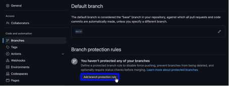
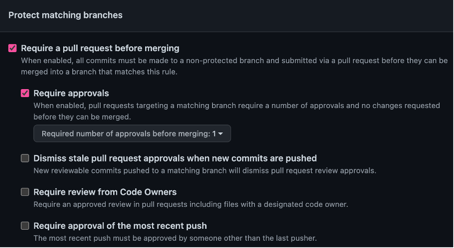
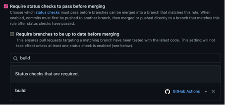
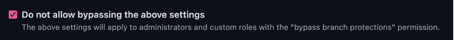
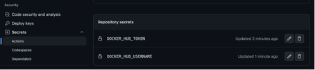
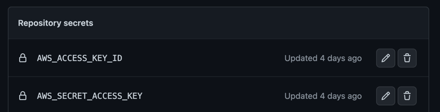

# Besvarelse på teorioppgaver

## Del 1 - DevOps-prinsipper
### 1.1
**Hva er utfordringene med dagens systemutviklingsprosess - og hvordan vil innføring av DevOps kunne være med på å løse disse? Hvilke DevOps prinsipper blir brutt?**

Sånn som det er nå, så er det ingen som må ta konsekvensene av valgene de tar under utviklingsprosessen. Utviklerne har kun ansvar for utviklingen, et team har ansvar for testing, mens en annen avdeling har ansvar for operations. Det blir mye overlevering, noe som skaper unødvendig waste ved at man må sette seg inn i hverandres arbeid, og i visse tilfeller også må vente på å få noe å gjøre til et team er ferdig med sitt. Det er også mye manuelle prosesser, både for testing og for deployment. 

Dette kan skape både waste og teknisk gjeld, da man bruker unødvendig tid på å manuelt gjennomføre prosessene, i tillegg til at feil mye lettere kan oppstå enn hvis prosessen hadde vært automatisert. Alle disse punktene kan bli løst ved hjelp av en DevOps-kultur, da teams har ansvar for hele prosessen og dermed selv må ta ansvar for konsekvensene, i tillegg til at man har mer oversikt og kontroll, og automatiserte prosesser hjelper på en bedre flyt og mindre sjanse for menneskelige feil.

### 1.2
**En vanlig respons på mange feil under release av ny funksjonalitet er å gjøre det mindre hyppig, og samtidig forsøke å legge på mer kontroll og QA. Hva er problemet med dette ut ifra et DevOps perspektiv, og hva kan være en bedre tilnærming?**

Dette løser ikke problemet, det bare skyver det videre. Isteden for å løse problemet ved roten, så flytter de ansvaret over på QA for å plukke det opp. Det tar dermed mest sannsynlig lenger tid før problemet blir oppdaget, og det vil da også være vanskeligere å fikse. Dette kan medføre unødvendig teknisk gjeld. 

En bedre tilnærming ville vært å automatisere prosesser for å eliminere menneskelige feil ved release av kode, og i tillegg gi hvert team ansvar for hele prosessen i utviklingen, inkludert vedlikehold og operations.

### 1.3
**Teamet overleverer kode til en annen avdeling som har ansvar for drift – hva er utfordringen med dette ut ifra et DevOps perspektiv, og hvilke gevinster kan man få ved at team han ansvar for både drift- og utvikling?**

Når utviklerne ikke selv har ansvar for vedlikehold og drift, så har de heller ikke «skin in the game». De utvikler dermed med tanken om at hva enn de lager ikke vil være deres problem uansett og de vil aldri måtte lære av egen smerte, siden de sender alt ansvar videre til driftsavdelingen som må ta hånd om alle konsekvensene selv. 

Det betyr at driftsavdelingen vil bruke mer tid på å fikse unødvendige problemer da utviklingsavdelingen ikke er like nøye på det de lager, i tillegg til at driftsavdelingen ikke kjenner koden like godt som det utviklerne gjør. Dette fører også til mer unødvendig tid for å sette seg inn i koden for å forstå problemet, som igjen fører til enda mer unødvendig teknisk gjeld, da dette er tid som kunne blitt brukt på å utvikle nye funksjoner.

### 1.4
**Å release kode ofte kan også by på utfordringer. Beskriv hvilke- og hvordan vi kan bruke DevOps prinsipper til å redusere eller fjerne risiko ved hyppige leveranser.**

Hyppige leveranser kan by på utfordringer om prosessen ikke er lik for alle miljøer, og enda verre om disse prosessene ikke er automatisert. Det er også viktig å bygge prosjektet kun en gang, dette i CI-prosessen, sånn at alle videre prosesser har samme forutsetninger, og vi kan eliminere byggeprosessen som en del av feilen. 

Alle disse tingene kan føre til at menneskelige feil i prosessene gir oss unødvendige komplikasjoner, som igjen fører til både waste og teknisk gjeld. Continous Integration og Continous Delivery er viktige prinsipper i et DevOps-miljø, som bedrer både kvaliteten, uforutsigbarheten og flyten i en prosess.

## Del 2 - Continous Integration
### 2.3
**Branch protection og status sjekker - Beskriv hva sensor må gjøre for å konfigurere sin fork på en slik måte at:**
- Ingen kan pushe kode direkte på main branch
- Kode kan merges til main branch ved å lage en Pull request med minst en godkjenning
- Kode kan merges til main bare når feature branchen som pull requesten er basert på, er verifisert av GitHub Actions.



1. Først går man inn på instillinger i sitt prosjekt. Deretter trykker man ```Branches -> Add branch protection rule```





2. Deretter krysser man av for følgende:
```
* Require a pull request before merging
    * Require approvals (1)
* Require status checks to pass before merging
* Do not allow bypassing the above settings
```
## Del 3 - Docker
### 3.1
**Beskriv hva du må gjøre for å få workflow til å fungere med din DockerHub konto? Hvorfor feiler workflowen?**



Workflowen feiler fordi man i workflowen trenger DockerHub crendentials for å kunne koble seg til DockerHub-kontoen. Disse er skrevet som Github Actions repository secrets, men det har vi jo ikke lagt til!
Dette gjør man ved å trykke:

```Settings -> Secrets -> Actions -> New repository secret```

Her legger man til navnet på Secreten (så den matcher variablen i workflowen), og den nødvendige verdien.

### 3.2
**Beskriv med egne ord hva sensor må gjøre for å få sin fork til å laste opp container image til sitt eget ECR repo.**

For å få sin fork til å laste opp container image til sitt eget ECR-repo, må man endre på disse tingene i ```docker.yml```:
```
  docker build . -t <TAGNAME>
  docker tag <TAGNAME> 244530008913.dkr.ecr.eu-west-1.amazonaws.com/<ECR-REPO>:$rev
  docker push 244530008913.dkr.ecr.eu-west-1.amazonaws.com/<ECR-REPO>:$rev
```

I tillegg må man legge til sine egne AWS Access Keys i Guthub Action Secrets for å kunne koble til sin AWS-konto:


## Del 5 - Terraform og CloudWatch Dashboards
### 5.1
**Forklar med egne ord. Hva er årsaken til dette problemet? Hvorfor forsøker Terraform å opprette en bucket, når den allerede eksisterer?**

Terraform forsøker å opprette en eksisterende bucket fordi den allerede blir laget et annet sted i Terraform-konfigurasjonen,
i dette tilfelle i ```provider.tf```. Vi kan derfor endre ```"aws_s3_bucket``` i ```databucket.tf``` fra ```resource``` til ```data```, hvis ikke 
vil disse få en konflikt. Man kan også kjøre en ```terraform import aws_s3_bucket.analyticsbucket <BUCKET-NAME>``` for å importere den eksisterende bucketen.
